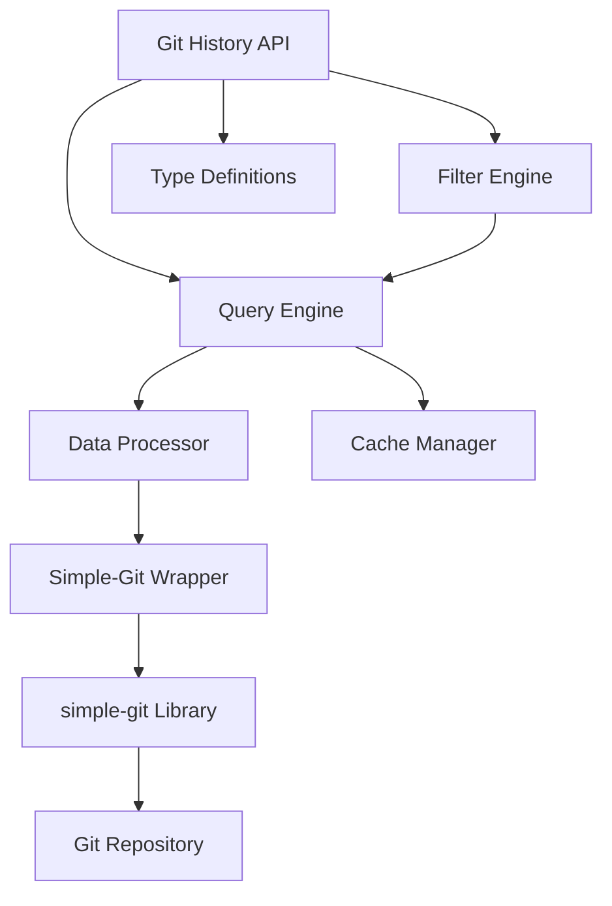

# Git History Module Design Document

## Overview

The Git History Module is a TypeScript library that provides a clean, type-safe interface for accessing and analyzing git repository data. It serves as the foundation for engineering analytics tools by abstracting away the complexity of git command execution and data parsing. The module follows a layered architecture with clear separation between data access, processing, and presentation layers.

## Architecture

The module follows a three-layer architecture built on top of the `simple-git` library:

1. **Data Access Layer**: Uses `simple-git` for git operations with custom command extensions
2. **Processing Layer**: Enhances and structures git data into domain-specific typed objects
3. **API Layer**: Provides the public interface with filtering, pagination, and querying capabilities

**Library Choice: `simple-git`**
- Mature TypeScript support and active maintenance
- Handles cross-platform git command execution
- Provides structured responses for common operations
- Allows custom git commands for specialized queries
- Reduces implementation complexity while maintaining flexibility



## Dependencies

### Primary Dependency: simple-git
- **Package**: `simple-git` (^3.x)
- **Purpose**: Git command execution and basic data parsing
- **Benefits**: 
  - Cross-platform compatibility
  - TypeScript support
  - Handles git command complexity
  - Active maintenance and community
- **Limitations**: 
  - Some advanced git operations may require custom commands
  - Performance overhead compared to direct libgit2 bindings

### Development Dependencies
- `@types/node` - Node.js type definitions
- Standard TypeScript toolchain (already in project)

## Components and Interfaces

### Core Types

```typescript
// Core commit data structure
export interface GitCommit {
  hash: string;
  shortHash: string;
  author: GitAuthor;
  committer: GitAuthor;
  date: Date;
  message: string;
  subject: string;
  body?: string;
  fileChanges: FileChange[];
  stats: CommitStats;
  isMerge: boolean;
  parentHashes: string[];
  branch?: string;
}

export interface GitAuthor {
  name: string;
  email: string;
}

export interface FileChange {
  path: string;
  oldPath?: string; // for renames
  changeType: 'added' | 'modified' | 'deleted' | 'renamed' | 'copied';
  linesAdded: number;
  linesDeleted: number;
  isBinary: boolean;
}

export interface CommitStats {
  totalFiles: number;
  totalInsertions: number;
  totalDeletions: number;
}

// Query and filter interfaces
export interface GitHistoryQuery {
  since?: Date;
  until?: Date;
  authors?: string[];
  authorPattern?: string;
  filePaths?: string[];
  filePatterns?: string[];
  branches?: string[];
  maxCount?: number;
  skip?: number;
  sortBy?: 'date' | 'author' | 'hash';
  sortOrder?: 'asc' | 'desc';
  includeStats?: boolean;
  includeDiff?: boolean;
}

export interface GitHistoryResult {
  commits: GitCommit[];
  totalCount: number;
  hasMore: boolean;
  query: GitHistoryQuery;
}
```

### Main API Class

```typescript
export class GitHistoryModule {
  constructor(repositoryPath?: string, options?: GitHistoryOptions);
  
  // Core query methods
  async getCommits(query?: GitHistoryQuery): Promise<GitHistoryResult>;
  async getCommit(hash: string): Promise<GitCommit | null>;
  async getCommitsByAuthor(author: string, query?: GitHistoryQuery): Promise<GitHistoryResult>;
  async getCommitsByDateRange(since: Date, until: Date, query?: GitHistoryQuery): Promise<GitHistoryResult>;
  async getCommitsByFiles(filePaths: string[], query?: GitHistoryQuery): Promise<GitHistoryResult>;
  
  // Repository information
  async getRepositoryInfo(): Promise<GitRepositoryInfo>;
  async getBranches(): Promise<string[]>;
  async getAuthors(): Promise<GitAuthor[]>;
  
  // Utility methods
  isValidRepository(): Promise<boolean>;
  getRepositoryPath(): string;
}
```

### Internal Components

#### Simple-Git Wrapper
Wraps the `simple-git` library with domain-specific functionality:

```typescript
class GitWrapper {
  private git: SimpleGit;
  private repositoryPath: string;
  
  async getCommitLog(options: GitLogOptions): Promise<LogResult>;
  async getCommitDetails(hash: string): Promise<CommitResult>;
  async getBranches(): Promise<BranchSummary>;
  async getFileChanges(hash: string): Promise<DiffResult>;
  
  // Custom commands for specialized queries
  async executeCustomCommand(command: string[]): Promise<string>;
}
```

#### Data Processor
Enhances simple-git data structures into domain-specific objects:

```typescript
class GitDataProcessor {
  enhanceCommitData(simpleGitCommit: LogResult): GitCommit[];
  processFileChanges(diffResult: DiffResult): FileChange[];
  normalizeAuthorInfo(author: any): GitAuthor;
  calculateCommitStats(fileChanges: FileChange[]): CommitStats;
  
  // Handle data that simple-git doesn't provide directly
  parseCustomLogOutput(rawOutput: string): Partial<GitCommit>[];
}
```

#### Query Engine
Handles filtering, sorting, and pagination:

```typescript
class GitQueryEngine {
  buildGitLogCommand(query: GitHistoryQuery): GitLogCommand;
  applyFilters(commits: GitCommit[], query: GitHistoryQuery): GitCommit[];
  applySorting(commits: GitCommit[], sortBy: string, order: string): GitCommit[];
  applyPagination(commits: GitCommit[], skip: number, limit: number): GitCommit[];
}
```

#### Cache Manager
Provides optional caching for performance optimization:

```typescript
class GitCacheManager {
  private cache: Map<string, any>;
  private ttl: number;
  
  get<T>(key: string): T | null;
  set<T>(key: string, value: T, ttl?: number): void;
  invalidate(pattern?: string): void;
  clear(): void;
}
```

## Data Models

### Repository Structure
The module expects to work with standard git repositories and will automatically detect the `.git` directory. It supports:

- Local repositories
- Repositories with submodules (treated as separate entities)
- Bare repositories
- Repositories with multiple remotes

### Commit Data Flow
1. Raw git log output is retrieved using `git log` with custom formatting
2. Output is parsed into structured `GitCommit` objects
3. File changes are extracted using `git show --stat` and `git diff-tree`
4. Data is filtered and sorted according to query parameters
5. Results are paginated and returned with metadata

### File Change Tracking
File changes are tracked with detailed information:
- Path changes (for renames and moves)
- Line-level statistics (additions/deletions)
- Binary file detection
- Change type classification

## Error Handling

### Error Types
```typescript
export class GitHistoryError extends Error {
  constructor(message: string, public code: string, public cause?: Error) {
    super(message);
  }
}

export class RepositoryNotFoundError extends GitHistoryError {
  constructor(path: string) {
    super(`Git repository not found at path: ${path}`, 'REPO_NOT_FOUND');
  }
}

export class GitCommandError extends GitHistoryError {
  constructor(command: string, exitCode: number, stderr: string) {
    super(`Git command failed: ${command}`, 'GIT_COMMAND_FAILED');
  }
}

export class InvalidQueryError extends GitHistoryError {
  constructor(message: string) {
    super(`Invalid query: ${message}`, 'INVALID_QUERY');
  }
}
```

### Error Handling Strategy
- All git command failures are caught and wrapped in typed errors
- Invalid repository paths throw `RepositoryNotFoundError`
- Malformed queries throw `InvalidQueryError`
- Network-related issues (for remote operations) are handled gracefully
- Partial failures (e.g., some commits unparseable) are logged but don't fail the entire operation

## Testing Strategy

### Unit Testing
- **Git Command Executor**: Mock git command execution and test parsing logic
- **Data Processor**: Test parsing of various git output formats
- **Query Engine**: Test filtering, sorting, and pagination logic
- **Cache Manager**: Test cache operations and TTL behavior

### Integration Testing
- Test against real git repositories with known commit history
- Test with repositories containing edge cases (merge commits, binary files, renames)
- Test performance with large repositories
- Test error scenarios (corrupted repos, missing git, permission issues)

### Test Data Strategy
- Create test repositories with controlled commit history
- Include edge cases: empty repos, single commits, complex merge histories
- Test with different git configurations and author formats
- Include repositories with various file types and sizes

### Performance Testing
- Benchmark query performance with repositories of different sizes
- Test memory usage with large result sets
- Validate caching effectiveness
- Test concurrent query handling

### Mocking Strategy
For unit tests, mock the git command execution to avoid dependency on actual git repositories:

```typescript
// Mock git command responses
const mockGitResponses = {
  'log --oneline': 'abc123 Initial commit\ndef456 Add feature',
  'show --stat abc123': 'file1.ts | 10 ++++++++++\n1 file changed, 10 insertions(+)'
};
```

This approach allows testing the parsing and processing logic without requiring actual git repositories in the test environment.