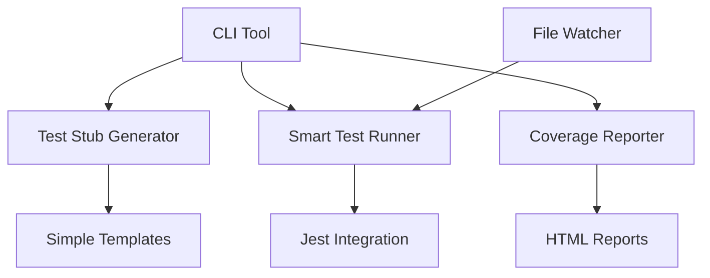

# Design Document

## Overview

The Rapid Test Suite is a lightweight testing tool that focuses on three core capabilities: quickly generating test stubs, running only relevant tests, and providing clear coverage feedback. It's designed to work with existing Jest setups and enhance developer productivity without adding complexity.

The tool is built as a simple CLI with optional file watching, focusing on practical everyday testing needs rather than comprehensive test automation.

## Architecture

Simple, focused architecture with minimal components:



## Components and Interfaces

### Test Stub Generator
Creates test file stubs using TypeScript AST parsing for accurate function detection.

```typescript
interface StubGenerator {
  parseSourceFile(filePath: string): ParsedFile;
  generateStub(parsedFile: ParsedFile): string;
  createTestFile(sourceFile: string, outputPath: string): void;
}

interface ParsedFile {
  functions: FunctionInfo[];
  classes: ClassInfo[];
  exports: ExportInfo[];
}

interface FunctionInfo {
  name: string;
  parameters: string[];
  isAsync: boolean;
  isExported: boolean;
}
```

### Smart Test Runner
Runs Jest with intelligent file selection based on git changes.

```typescript
interface SmartRunner {
  runAffectedTests(): Promise<TestResults>;
  runAllTests(): Promise<TestResults>;
  watchMode(): void;
}
```

### Coverage Reporter
Simple coverage reporting with clear gap identification.

```typescript
interface CoverageReporter {
  generateReport(): Promise<void>;
  showUncoveredLines(): string[];
}
```

## Data Models

### Simple Configuration
```typescript
interface Config {
  testDir: string;
  sourceDir: string;
  coverageThreshold: number;
}
```

### Basic Test Results
```typescript
interface TestResults {
  passed: number;
  failed: number;
  coverage: number;
  uncoveredFiles: string[];
}
```

## Error Handling

### Simple Error Strategy
- Log errors clearly with actionable messages
- Fall back to running all tests if smart selection fails
- Continue execution even if coverage reporting fails
- Provide helpful suggestions for common issues

## Testing Strategy

### Basic Testing Approach
- Unit tests for core functions
- Integration tests for Jest integration
- Simple end-to-end tests for CLI commands

### Test Organization
```
tests/
├── unit/
├── integration/
└── e2e/
```

## Implementation Approach

### Core Features
1. **Test Stub Generation**: Use TypeScript compiler API for reliable AST parsing to find exported functions and create accurate test stubs
2. **Smart Test Running**: Use git to find changed files and run related tests using Jest's built-in capabilities
3. **Coverage Reporting**: Leverage Jest's coverage reports and add simple HTML output with highlighted gaps

### Technology Choices
- **TypeScript Compiler API**: Lightweight, reliable AST parsing without external dependencies
- **Jest**: Use existing Jest setup, no need for multi-framework support
- **Node.js**: Simple CLI tool using built-in modules where possible
- **Git Integration**: Use git commands to detect changed files

### Minimal Dependencies
- Use TypeScript's built-in compiler API (already available in TS projects)
- Use Jest's existing parallel execution
- Leverage git for change detection
- Keep external dependencies to minimum